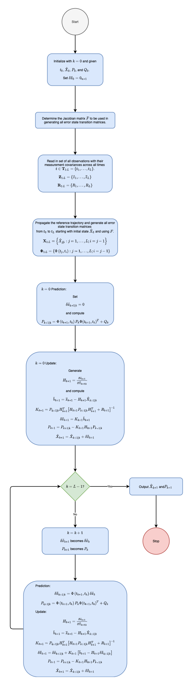

# Linearized Kalman Filter

## Nomenclature

* $n$, number of elements in state $\vec{X}$,
* $m$, number of elements in observation $\vec{z}$,
* $\Delta t$, difference between to times, e.g., $\Delta t = t_{k+1} - t_k$,
* $\hat{X}_0$, $n\times 1$ *a priori* initial state vector at time $t_0$,
* $\delta\vec{x}_0$, $n\times 1$ initial state error vector at time $t_0$,
* $P_0$, $n\times n$ *a priori* initial covariance matrix at time $t_0$,
* $\delta\vec{x}_{k}$, $n\times 1$ state error vector at time $t_k$ where $k > 0$,
* $\hat{P}_k$, $n\times n$ covariance $P$ at time $t_k$,
* $\delta\vec{x}_{k+1|k}$, $n\times 1$ predicted state error vector at time $t_{k+1}$,
* $\hat{X}_{k+1|k}$, predicted state $\vec{X}$ at time $t_{k+1}$,
* $\hat{P}_{k+1|k}$, predicted  $n\times n$ covariance $P$ at time $t_{k+1}$ given its estimate from time $t_k$,
* $Q_k$,  $n\times n$ process noise matrix at time $t_k$,
* $\Phi\left(t_{k+1}, t_k\right)$,  $n\times n$ error state transition matrix (STM) from $t_k$ to $t_{k+1}$,
* $F$, $n\times n$ partial derivatives (Jacobian) matrix of "state rates" [@vallado2013fundamentals-of],
* $I_{n\times n}$, $n \times n$ identity matrix,
* $\vec{z}_{k+1}$, observation vector at time $t_{k+1}$,
* $R_{k+1}$, $m\times m$ observation covariance matrix at time $t_{k+1}$,
* $H_{k+1}$, $m\times n$ partial derivative matrix mapping state space to observation space at time $t_{k+1}$,
* $\tilde{b}_{k+1}$, $m\times 1$ residuals matrix,
* $K_{k+1}$, $n \times m$ Kalman gain matrix at time $t_{k+1}$,
* $\delta\vec{x}_{k+1}$, $n\times 1$ updated state error vector at time $t_{k+1}$,
* $\hat{X}_{k+1}$, $n\times 1$ updated state $\vec{X}$ at time $t_{k+1}$,
* $P_{k+1}$, $n\times n$ updated covariance matrix $P$ at time $t_{k+1}$.

## Application

The linear (i.e., *linearized*) Kalman filter (LKF) is an adaptation of the (discrete) Kalman filter  for nonlinear systems.

A key assumption is that the *a priori* state generated reference trajectory  is sufficiently close to the actual (true) trajectory.

The *a priori* state at time $t_0$, i.e., $\hat{X}_0$ and $P_0$, are used to define the reference trajectory across all timestamps for which observations are received. I.e., for all $t_k$ where $k>0$. This means that the reference trajectory is not recalculated at each filter iteration.

Since the initial state is used for all initial calculations, the state and the update steps are separated, but is also why the LKF cannot handle large changes in state like the Extended Kalman filter (EKF) can ... `insert reference here`

!!! bug

    Add link to EKF page.

!!! warning
    
    We do not use the updated state in subsequent predictions. All computations are based on a nominal trajectory without incorporating updates.

For the first iteration, the initial state vector error is assumed to be zero, i.e., $\delta\vec{x}_0 = 0_{n\times 1}$.

The error state transition matrix $\Phi$ can be found by numerical integration, however, for most LKF filters the following approximation of the Jacobian matrix can be used:

$$
\Phi\left(t_{k+1}, t_k\right) = I_{n\times n} + F(t_{k+1}-t_k) + \frac{1}{2!}F^2(t_{k+1}-t_k)^2 + \frac{1}{3!}F^3(t_{k+1}-t_k)^3 + \ldots.
$$

Specifics on process noise $Q$ are omitted here, but more detail on them can be found in ... `add reference here`

!!! bug

    Add reference to process noise in paragraph above.

The $\tilde{b}$ vector contains the residuals, and note that we use $H\delta{x}$ in this implementation, just as in nonlinear least squares ... `add reference here`

!!! bug

    Add reference to nonlinear least squares in paragraph above.

### Good For

* systems that require current estimates of the state and computational speed,
* autonomous navigation systems and similar tasks,

### Draw Backs

* errors will grow with time (the reference trajectory will diverge from the truth) and at some point the state must be reinitialized and a new reference trajectory must be generated

## Algorithm [@vallado2013fundamentals-of]

At time $t_0$ we have $\delta\vec{x}_0$, $\hat{X}_0$, $P_0$ and $Q_0$.

Determine the Jacobian matrix $F$ once at the outset. See discussion of the Jacobian matrix in [Linear Dynamic Systems](../../dynamics/linear/top_linear_dynamic_systems.md){:target="_blank"}.

At this stage $k=0$ such that 

$$
\begin{align}
\delta\vec{x}_k &= \delta\vec{x}_0 = 0_{n\times 1}, 
\\
\hat{X}_k &= \hat{X}_0,
\\
P_k &= P_0,
\\
Q_k &= Q_0,
\end{align}
$$

and we have a set of $L$ number of obserations $\mathbf{Z}_{1:L} = \left\{\vec{z}_1, \ldots, \vec{z}_L \right\}$ spanning times $t_1, \ldots, t_L$. 

To faciliate notation, let $\mathbf{T}_{1:L} = \left\{t_1, \ldots, t_L \right\}$.

Say we choose to use numerical integration to determine the error state transition matrices across all timestamps in $T_{1:L}$, and that the integration is performed via a *propagator* that also uses integration to propagate the reference trajectory.

We can use such a *propagator* now to perform all of those computations ahead of performing any filter update steps, e.g.,

$$
\mathbf{X}_{1:L}, \mathbf{\Phi}_{1:L} = propagator\left(t_0, \hat{X}_0, \mathbf{T}_{1:L}\right),
$$

where

$$
\begin{align}
\mathbf{X}_{1:L} &= \left\{\hat{X}_{j|i} : j = 1, \ldots, L; i = j-1  \right\},
\\
\mathbf{\Phi}_{1:L} &= \left\{\Phi\left(t_j, t_i\right) : j = 1, \ldots, L; i = j-1   \right\}.
\end{align}
$$

### Prediction $k=0$

For the first prediction step we select the first elements of $\mathbf{X}_{1:L}$ and $\mathbf{\Phi}_{1:L}$, i.e., $\hat{X}_{1|0}$ and $\Phi\left(t_1, t_0\right)$, respectively.

We don't do anything yet with the predicted state $\hat{X}_{1|0}$, but hold onto it for the update step.

We do, however, compute the predicted state error and predicted error covariance as

$$
\begin{align}
\delta\vec{x}_{1|0} &= \Phi\left(t_1, t_0\right) \delta\vec{x}_0 = \Phi\left(t_1, t_0\right) 0_{n\times 1} = 0, 
\\
P_{1|0} &= \Phi\left(t_1, t_0\right)  P_0 \Phi\left(t_1, t_0\right)^T + Q_0,
\end{align}
$$

respectively. Notice that since $\delta\vec{x}_0 = 0_{n\times1}$ that the first predicted state error is also zero.

### Update $k=0$

Now for the first update step. First generate the observation matrix via the relationship

$$
H_1 = \frac{\partial \vec{z}_1}{\partial \hat{X}_{1|0}},
$$

then compute the residuals vector and Kalman gain as

$$
\begin{align}
\tilde{b}_1 &= \vec{z}_1 - H_1\hat{X}_{1|0},
\\
K_1 &= P_{1|0} H_1^T \left[ H_1 P_{1|0}  H_1^T + R_1\right]^{-1},
\end{align}
$$

respectively.

Now for the state error estimate, which is computed in general by the equation

$$
\delta\vec{x}_{k+1} = \delta\vec{x}_{k+1|k} + K_{k+1} \left[ \tilde{b}_{k+1} - H_{k+1}\delta\vec{x}_{k+1|k}\right], \label{eq:general_state_error} \tag{3}
$$

but recall that, since we're still on the first filter iteration step with $k=0$, the first predicted state error ended up being zero, i.e., $\delta\vec{x}_{k+1|k} = \delta\vec{x}_{1|0} = 0$. So when computing Eq. \eqref{eq:general_state_error} for the first iteration, it simply reduces to

$$
\delta\vec{x}_1 = K_1 \tilde{b}_1. \label{eq:first_iter_state_error} \tag{4}
$$

Then, compute the error covariance estimate and state estimate as

$$
\begin{align}
P_1 &= P_{1|0} - K_1 H_1 P_{1|0},
\\
\hat{X}_1 &= \hat{X}_{1|0} + \delta\vec{x}_1,
\end{align}
$$

respectively, and that concludes the first filter prediction and update steps.

Now we process the remainder of filter iterations $k=1,\ldots, L$ with the remainder of observations in $\mathbf{Z}_{1:L}$, predicted trajectory states  in $\mathbf{X}_{1:L}$, and error state transition matrices in $\mathbf{\Phi}_{1:L}$, all indexed from $j=2, \ldots, L$.

Keep in mind the relationship between $j$ and $k$ is $j = k+1$ and that as we transition from one filter iteration to the next that the $\delta\vec{x}_{k+1}$ and $P_{k+1}$ from the update step becomes $\delta\vec{x}_{k}$ and $P_{k}$, respectively, in the subsequent filter iteration's prediction step.

### Prediction $k=1,\ldots,L$

With $j=k+1$ select $\hat{X}_{j|j-1} = \hat{X}_{k+1|k}$ and $\Phi\left(t_j, t_{j-1}\right) = \Phi\left(t_{k+1}, t_k\right)$ from $\mathbf{X}_{1:L}$ and $\mathbf{\Phi}_{1:L}$, respectively.

Hold on to $\hat{X}_{k+1|k}$ for the update step and use $\Phi\left(t_{k+1}, t_k\right)$ to compute

$$
\begin{align}
\delta\vec{x}_{k+1|k} &= \Phi\left(t_{k+1}, t_k\right) \delta\vec{x}_k, 
\\
P_{k+1|k} &= \Phi\left(t_{k+1}, t_k\right)  P_k \Phi\left(t_{k+1}, t_k\right)^T + Q_k.
\end{align}
$$

### Update $k=1,\ldots,L$

Select $\vec{z}_j = \vec{z}_{k+1}$ from $\mathbf{Z}_{1:L}$, generate the observation matrix via

$$
H_{k+1} = \frac{\partial \vec{z}_{k+1}}{\partial \hat{X}_{k+1|k}},
$$

and perform the following computations:

$$
\begin{align}
\tilde{b}_{k+1} &= \vec{z}_{k+1} - H_{k+1}\hat{X}_{k+1|k},
\\
K_{k+1} &= P_{k+1|k} H_{k+1}^T \left[ H_{k+1} P_{k+1|k}  H_{k+1}^T + R_{k+1}\right]^{-1},
\\
\delta\vec{x}_{k+1} &= \delta\vec{x}_{k+1|k} + K_{k+1} \left[ \tilde{b}_{k+1} - H_{k+1} \delta\vec{x}_{k+1|k} \right],
\\
P_{k+1} &= P_{k+1|k} - K_{k+1} H_{k+1} P_{k+1|k},
\\
\hat{X}_{k+1} &= \hat{X}_{k+1|k} + \delta\vec{x}_{k+1}.
\end{align}
$$

After processing the $L^\text{th}$ update step, $\hat{X}_L$ and $P_L$ represent the *current* state estimate and error covarinace at time $t_L$, respectively.

